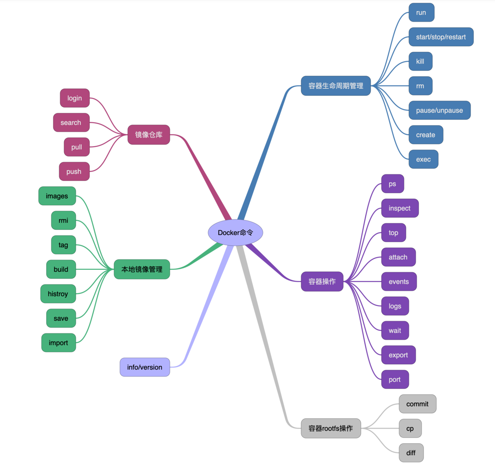

## 分类

本章节记录docker命令在大部分情境下的使用，如果想了解每一个选项的细节，请参考官方文档，根据
docker官网案例，总的来说分为以下几种：
- Docker环境信息 — `docker [info|version]`
- 容器生命周期管理 — `docker [create|exec|run|start|stop|restart|kill|rm|pause|unpause]`
- 容器操作管理 — `docker [ps|inspect|top|attach|wait|export|port|rename|stat]`
- 容器rootfs命令 — `docker [commit|cp|diff]`
- 镜像仓库 — `docker [login|pull|push|search]`
- 本地镜像管理 — `docker [build|images|rmi|tag|save|import|load]`
- 容器资源管理 — `docker [volume|network]`
- 系统日志信息 — `docker [events|history|logs]`

