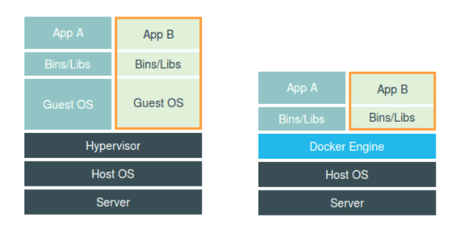

## 什么是虚拟化

如果要对物理资源进行管理，第一步，就是“虚拟化”。虚拟化是云计算的基础。简单来说，虚拟化就是在一台物理服务器上，运行多台“虚拟服务器”。这种虚拟服务器，也叫**虚拟机（VM，Virtual Machine）**。

从表面来看，这些虚拟机都是独立的服务器，但实际上，它们共享物理服务器的CPU、内存、硬件、网 卡等资源。通过模拟计算机的硬件，来实现在同一台计算机上同时运行不同的操作系统的技术。常用的
vmwore、openstack、kvm都是使用的虚拟化技术

- 物理机，通常称为“宿主机（Host）”
- 虚拟机，则称为“客户机（Guest）”。

谁来完成物理资源虚拟化的工作呢？就是大名鼎鼎的 **Hypervisor** 。

Hypervisor也叫做VMM（Virtual Machine Monitor，虚拟机监视器）。它不是一款具体的软件，而是 一类软件的统称。Hypervisor是一种运行在基础物理服务器硬件之上的软件层，可以虚拟化硬件资源，
例如：cpu，硬盘，内存，声卡等资源。然后我们可以通过在虚拟化出来的资源之上安装操作系统。也 就是所谓的虚拟机。通过Hyperviosr我们可以创建不同的虚拟机，并且每个虚拟机都是分离、独立的系
统。这样操作，我们就可以在一台硬件服务器和本地操作系统之上虚拟化出很多服务器，供我们用来部 署应用程序。一台硬件服务器可以虚拟化多台服务器，让计算机资源得以充分利用。

Hypervisor分为两大类：

- 第一类，hypervisor直接运行在物理机之上。虚拟机运行在hypervisor之上。
- 第二类，物理机上安装正常的操作系统（例如Linux或Windows），然后在正常操作系统上安装 hypervisor，生成和管理虚拟机。像VMware、KVM、Xen、Virtual Box，都属于Hypervisor。

人们在使用虚拟化一段时间后，发现它存在一些问题，不同的用户，有时候只是希望运行各自的一些简单程序，跑一个小进程。为了不相互影响，就要建立虚拟机。如果建虚拟机，显然浪费就会有点大，而
且操作也比较复杂，花费时间也会比较长。而且，有的时候，想要迁移自己的服务程序，就要迁移整个 虚拟机。显然，迁移过程也会很复杂。安装的虚拟机越多，消耗的资源对应越多。

环境兼容性问题，开发时的环境运行正常，部署到虚拟机环境进行测试则有可能发生错误。

有没有办法更灵活快速一些呢？有，这就引入了“容器（Container）”。

## 什么是容器

基于硬件级虚拟化技术的缺点和不足，后续又发展出来另一种虚拟化技术，即操作系统级别的虚拟化技 术。操作系统级虚拟化是运行在操作系统之上的虚拟化技术，它模拟的是运行在一个操作系统上的多个
不同进程，并将其封闭在一个密闭的容器内，该技术也就被称之为容器化技术。

容器就是在隔离环境运行的一个进程，如果进程停止，容器就会销毁。隔离的环境拥有自己的系统文件，IP地址，主机名等。容器也是虚拟化，但是属于“轻量级”的虚拟化。它的目的和虚拟机一样，都是为
了创造“隔离环境”。但是，它又和虚拟机有很大的不同——虚拟机是操作系统级别的资源隔离，而容器 本质上是进程级的资源隔离。

## 容器和虚拟化的区别

容器是将代码和环境打包在一起的一个集合，而虚拟机是在物理层面上分离出来一个操作系统；多个容 器可以运行在同一台硬件服务器上，并共享一个操作系统的内核资源。多个虚拟机也可以运行在同一台 服务器上，但每个虚拟机都需要有一个完整的操作系统。

## 虚拟化技术分类

- CPU虚拟化
- 网络虚拟化
- 服务器虚拟化
- 存储虚拟化
- 应用虚拟化

### CPU虚拟化

虚拟化在计算机方面通常是指计算元件在虚拟的基础上而不是真实的基础上运行。虚拟化技术可以扩大 硬件的容量，简化软件的重新配置过程。简单说来，CPU的虚拟化技术就是单CPU模拟多CPU并行，允
许一个平台同时运行多个操作系统，并且应用程序都可以在相互独立的空间内运行而互不影响，从而显 著提高计算机的工作效率。

### 网络虚拟化

网络虚拟化是目前业界关于虚拟化细分领域界定最不明确，存在争议较多的一个概念。微软眼中的“网络 虚拟化”，是指虚拟专用网络 (VPN)。VPN 对网络连接的概念进行了抽象，允许远程用户访问组织的内部
网络，就像物理上连接到该网络一样。网络虚拟化可以帮助保护 IT环境，防止来自 Internet 的威胁，同 时使用户能够快速安全的访问应用程序和数据。

### 服务器虚拟化

与网络虚拟化不同，服务器虚拟化却是虚拟化技术最早细分出来的子领域。根据2006年2月Forrester Research的调查，全球范围的企业对服务器虚拟化的认知率达到了75%。三分之一的企业已经在使用或
者准备部署服务器虚拟化。这个产生于20世纪60年代的技术日益显示出其重要价值。由于服务器虚拟化 发展时间长，应用广泛，所以很多时候人们几乎把服务器虚拟化等同于虚拟化。

### 存储虚拟化

随着信息业务的不断运行和发展，存储系统网络平台已经成为一个核心平台，大量高价值数据积淀下 来，围绕这些数据的应用对平台的要求也越来越高，不光是在存储容量上，还包括数据访问性能、数据
传输性能、数据管理能力、存储扩展能力等等多个方面。可以说，存储网络平台的综合性能的优劣，将 直接影响到整个系统的正常运行。因为这个原因，虚拟化技术又一子领域——虚拟存储技术，应运而 生。

### 应用虚拟化

前面几种虚拟化技术，主要还专注于对硬件平台资源的虚拟优化分配，随着IT应用的日益广泛，应用虚 拟化作为虚拟化家族的明日之星登上了历史舞台。2006年7月由Forrester咨询公司在美国对各种不同行
业的高层IT管理人员所做的一项研究显示，当今的机构现在将应用虚拟化当作是业务上的一个必由之 路，而不是一个IT决策。据统计，全世界目前至少有超过18万个机构在利用应用虚拟化技术进行集中IT 管理、加强安全性和减少总体成本。

## 扩展

Linux
Namespace是Linux提供的一种内核级别环境隔离的方法。不知道你是否还记得很早以前的Unix有一个叫chroot的系统调用（通过修改根目录把用户jail到一个特定目录下），chroot提供了一种简单的隔离模式：chroot内部的文件系统无法访问外部的内容。Linux
Namespace在此基础上，提供了对UTS、IPC、mount、PID、network、User等的隔离机制。

举个例子，我们都知道，Linux下的超级父亲进程的PID是1，所以，同chroot一样，如果我们可以把用户的进程空间jail到某个进程分支下，并像chroot那样让其下面的进程
看到的那个超级父进程的PID为1，于是就可以达到资源隔离的效果了（不同的PID namespace中的进程无法看到彼此）

Linux Cgroups 的全称是 Linux Control Group。它最主要的作用，就是限制一个进程组能够 使用的资源上限，包括 CPU、内存、磁盘、网络带宽等等。 此外，Cgroups
还能够对进程进行优先级设置、审计，以及将进程挂起和恢复等操作

Namespace 的作用是“隔离”，它让应用进程只能看到该 Namespace 内的“世界”；而 Cgroups 的作用是“限制”，它给这个“世界”围上了一圈看不见的墙