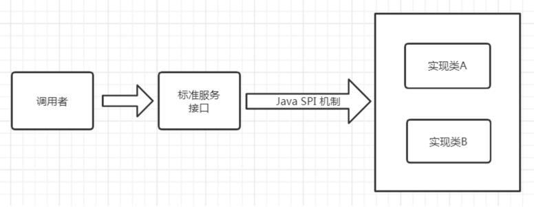
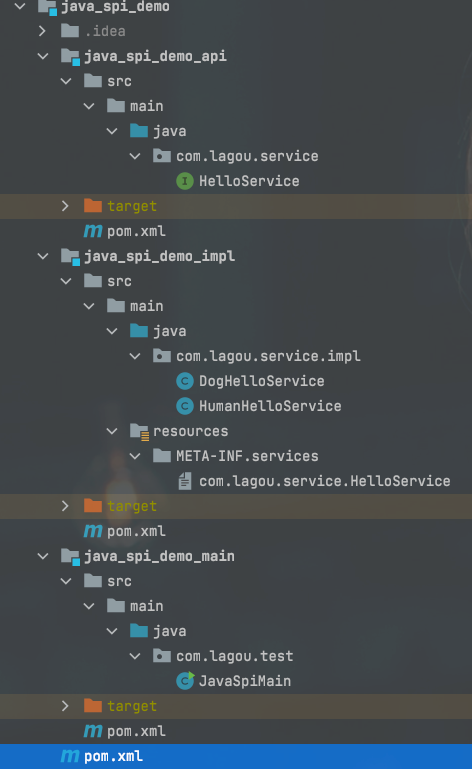
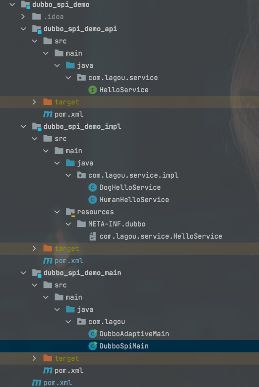

# SPI

## SPI简介
SPI 全称为 (Service Provider Interface) ，是JDK内置的一种服务提供发现机制。 目前有不少框架用它
来做服务的扩展发现，简单来说，它就是一种动态替换发现的机制。使用SPI机制的优势是实现解耦，
使得第三方服务模块的装配控制逻辑与调用者的业务代码分离。

## JDK中的SPI

Java中如果想要使用SPI功能，先提供标准服务接口，然后再提供相关接口实现和调用者。这样就可以通
过SPI机制中约定好的信息进行查询相应的接口实现。

SPI遵循如下约定：

1. 当服务提供者提供了接口的一种具体实现后，在META-INF/services目录下创建一个以“接口全
限定名”为命名的文件，内容为实现类的全限定名；
2. 接口实现类所在的jar包放在主程序的classpath中；
3. 主程序通过java.util.ServiceLoader动态装载实现模块，它通过扫描META-INF/services目录下
的配置文件找到实现类的全限定名，把类加载到JVM；
4. SPI的实现类必须携带一个无参构造方法；

## 实战

目录结构

1. 定义接口
```java
public interface HelloService {

    String sayHello();
}
```

2. 实现

```java
public class DogHelloService implements HelloService {

    @Override
    public String sayHello() {
        return "wang wang";
    }
}
```
```java
public class HumanHelloService implements HelloService {

    @Override
    public String sayHello() {
        return "hello 你好";
    }
}
```

`META-INF/services`文件下新建`com.lagou.service.HelloService`文件

内容如下
```
com.lagou.service.impl.DogHelloService
com.lagou.service.impl.HumanHelloService
```

3. SPI使用
```java
import java.util.ServiceLoader;
public class JavaSpiMain {

    public static void main(String[] args) {
        final ServiceLoader<HelloService> helloServices = ServiceLoader.load(HelloService.class);
        for (HelloService helloService: helloServices) {
            System.out.println(helloService.getClass().getName() + ":" + helloService.sayHello());
        }
    }
}
```


[代码地址](https://github.com/googalAmbition/spi-demo/tree/main/java_spi_demo)

## Dubbo中的SPI
dubbo中大量的使用了SPI来作为扩展点，通过实现同一接口的前提下，可以进行定制自己的实现类。
比如比较常见的协议，负载均衡，都可以通过SPI的方式进行定制化，自己扩展。Dubbo中已经存在的
所有已经实现好的扩展点。

## 实战

目录结构


1. 定义接口
```java
import org.apache.dubbo.common.URL;
import org.apache.dubbo.common.extension.Adaptive;
import org.apache.dubbo.common.extension.SPI;
@SPI("human")
public interface HelloService {

    String sayHello();

    @Adaptive
    String sayHello(URL url);
}
```

2. 实现
```java
import com.lagou.service.HelloService;
import org.apache.dubbo.common.URL;
public class DogHelloService implements HelloService {

    @Override
    public String sayHello() {
        return "wang wang";
    }

    @Override
    public String sayHello(URL url) {
        return "wang url";
    }
}
```


```java

import org.apache.dubbo.common.URL;
public class HumanHelloService implements HelloService {

    @Override
    public String sayHello() {
        return "hello 你好";
    }

    @Override
    public String sayHello(URL url) {
        return "hello url";
    }
}
```

`META-INF/dubbo`文件下新建`com.lagou.service.HelloService`文件
**注意：**之前是在services下

内容如下
```
human=com.lagou.service.impl.HumanHelloService
dog=com.lagou.service.impl.DogHelloService
```


3. 使用

```java
import org.apache.dubbo.common.URL;
import org.apache.dubbo.common.extension.ExtensionLoader;

public class DubboAdaptiveMain {

    public static void main(String[] args) {
        URL url = URL.valueOf("test://localhost/hello?hello.service=dog");
        HelloService adaptiveExtension = ExtensionLoader.getExtensionLoader(HelloService.class).getAdaptiveExtension();
        String msg = adaptiveExtension.sayHello(url);
        System.out.println(msg);
    }
}
```
```java
import org.apache.dubbo.common.extension.ExtensionLoader;

import java.util.Set;

public class DubboSpiMain {

    public static void main(String[] args) {
        // 获取扩展加载器
        ExtensionLoader<HelloService> extensionLoader = ExtensionLoader.getExtensionLoader(HelloService.class);
        // 遍历所有的支持的扩展点 META-INF.dubbo
        Set<String> extensions = extensionLoader.getSupportedExtensions();
        for (String extension: extensions) {
            String result = extensionLoader.getExtension(extension).sayHello();
            System.out.println(result);
        }
    }
}
```

[代码地址](https://github.com/googalAmbition/spi-demo/tree/main/dubbo_spi_demo)
