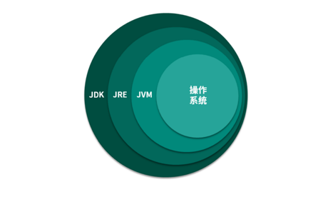
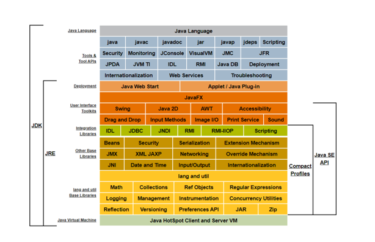
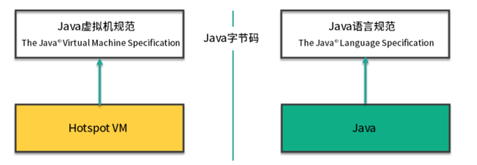
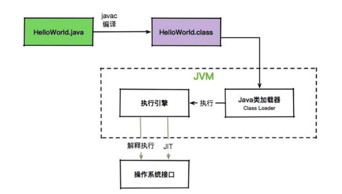

# JVM

> JVM是Java Virtual Machine（Java虚拟机）的缩写，JVM是一种用于计算设备的规范，它是一个虚构出来的计算
机，是通过在实际的计算机上仿真模拟各种计算机功能来实现的。

## JVM与操作系统

  Java 是一门抽象程度特别高的语言，提供了自动内存管理等一系列的特性。这些特性直接在操作系统上实现是不太
可能的，所以就需要 JVM 进行一番转换。

  从图中可以看到，有了 JVM 这个抽象层之后，Java 就可以实现跨平台了。JVM 只需要保证能够正确执行 .class 文
件，就可以运行在诸如 Linux、Windows、MacOS 等平台上了。

  而 Java 跨平台的意义在于一次编译，处处运行，能够做到这一点 JVM 功不可没。比如我们在 Maven 仓库下载同一
版本的 jar 包就可以到处运行，不需要在每个平台上再编译一次。

  现在的一些 JVM 的扩展语言，比如 Clojure、JRuby、Groovy 等，编译到最后都是 .class 文件，Java 语言的维护
者，只需要控制好 JVM 这个解析器，就可以将这些扩展语言无缝的运行在 JVM 之上了

> 应用程序、JVM、操作系统之间的关系 

我们用一句话概括 JVM 与操作系统之间的关系：JVM 上承开发语言，下接操作系统，它的中间接口就是字节码

## JVM、JRE、JDK 的关系

JVM 是 Java 程序能够运行的核心。但是需要注意，JVM 自己什么也干不了，你需要给它提供生产原料（.class 文
件） 。

仅仅是 JVM，是无法完成一次编译，处处运行的。它需要一个基本的类库，比如怎么操作文件、怎么连接网络等。
而 Java 体系很慷慨，会一次性将 JVM 运行所需的类库都传递给它。JVM 标准加上实现的一大堆基础类库，就组成
了 Java 的运行时环境，也就是我们常说的 JRE（Java Runtime Environment）

对于 JDK 来说，就更庞大了一些。除了 JRE，JDK 还提供了一些非常好用的小工具，比如 javac、java、jar 等。它
是 Java 开发的核心，让外行也可以炼剑！

我们也可以看下 JDK 的全拼，Java Development Kit。JVM、JRE、JDK 它们三者之间的关系，可以用一个包含关系表示。

## Java虚拟机规范和 Java 语言规范的关系

左半部分是 Java 虚拟机规范，其实就是为输入和执行字节码提供一个运行环境。右半部分是我们常说的 Java 语法
规范，比如 switch、for、泛型、lambda 等相关的程序，最终都会编译成字节码。而连接左右两部分的桥梁依然是
Java 的字节码。

如果 .class 文件的规格是不变的，这两部分是可以独立进行优化的。但 Java 也会偶尔扩充一下 .class 文件的格式，
增加一些字节码指令，以便支持更多的特性。

我们可以把 Java 虚拟机可以看作是一台抽象的计算机，它有自己的指令集以及各种运行时内存区域，学过《计算
机组成结构》的同学会在课程的后面看到非常多的相似性。

最后，我们简单看一下一个 Java 程序的执行过程，它到底是如何运行起来的。

