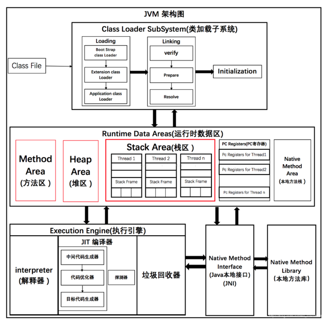
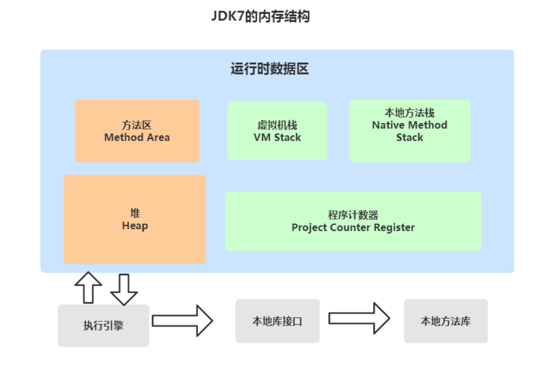
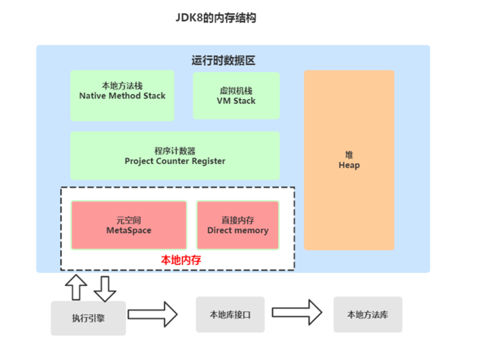
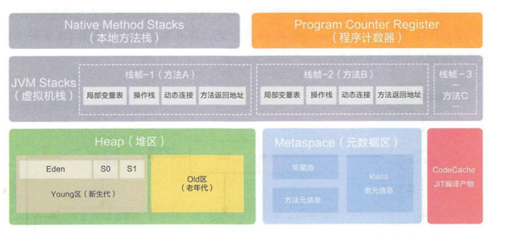
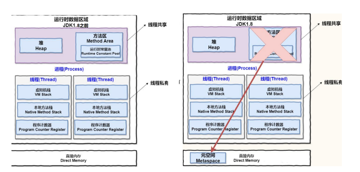

# JVM内存管理

## 整体架构
> 根据 JVM 规范，JVM 内存共分为虚拟机栈、堆、方法区、程序计数器、本地方法栈五个部分。

| 名称 | 特征 | 作用 |配置参数|异常|
| -----| ---- | ---- | ---- | ----|
|程序计数器  |占用内存小，线程私有，生命周期与线程相同  | 大致为字节码行号指示器 |-|-|
| 虚拟机栈 |线程私有，生命周期与线程相同，使用连续的内存空间  | Java 方法执行的内存模型，存储局部变量表、操作栈、动态链接、方法出口等信息 |-Xss|StackOverflowError/OutOfMemoryError|
| 堆 |线程共享，生命周期与虚拟机相同，可以不使用连续的内存地址  |保存对象实例，所有对象实例（包括数组）都 要在堆上分配  |-Xms -Xsx -Xmn|OutOfMemoryError|
|方法区  | 线程共享，生命周期与虚拟机相同，可以不使用连续的内存地址 | 存储已被虚拟机加载的类信息、常量、静态变量、即时编译器编译后的代码等数据 |-XX:PermSize:16MXX:MaxPermSize64M/-XX:MetaspaceSize=16MXX:MaxMetaspaceSize=64M|OutOfMemoryError|
|  本地方法栈|线程私有  | 为虚拟机使用到的Native 方法服务 |-|StackOverflowError/OutOfMemoryError|

> JVM分为五大模块： 类装载器子系统 、 运行时数据区 、 执行引擎 、 本地方法接口 和 垃圾收集模块 。

## 运行时内存

Java 虚拟机有自动内存管理机制，如果出现面的问题，排查错误就必须要了解虚拟机是怎样使用内存的。

**Java7和Java8内存结构的不同主要体现在方法区的实现**

- JDK7

- JDK8

- JDK7和JDK8变化小结

**对于Java8，HotSpots取消了永久代，那么是不是就没有方法区了呢？**

当然不是，方法区只是一个规范，只不过它的实现变了。

在Java8中，元空间(Metaspace)登上舞台，方法区存在于元空间(Metaspace)。同时，元空间不再与堆连续，而且是
存在于本地内存（Native memory）。

方法区Java8之后的变化

- 移除了永久代（PermGen），替换为元空间（Metaspace）

- 永久代中的class metadata（类元信息）转移到了native memory（本地内存，而不是虚拟机）

- 永久代中的interned Strings（字符串常量池） 和 class static variables（类静态变量）转移到了Java heap

- 永久代参数（PermSize MaxPermSize）-> 元空间参数（MetaspaceSize MaxMetaspaceSize）

Java8为什么要将永久代替换成Metaspace？

- 字符串存在永久代中，容易出现性能问题和内存溢出。
- 类及方法的信息等比较难确定其大小，因此对于永久代的大小指定比较困难，太小容易出现永久代溢出，太
- 大则容易导致老年代溢出。
- 永久代会为 GC 带来不必要的复杂度，并且回收效率偏低。
- Oracle 可能会将HotSpot 与 JRockit 合二为一，JRockit没有所谓的永久代。