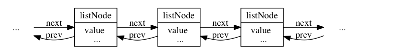
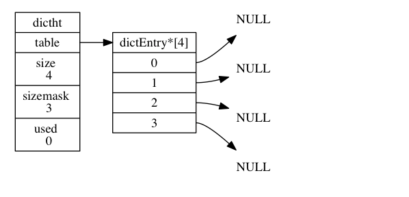
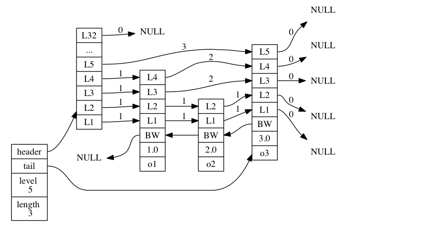
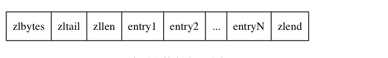

#  《Redis 设计与实现》

## 📚1、数据结构与对象
### 📚1.1、动态字符串 SDS

- 字符串长度获取O：len
- 杜绝缓冲区溢出：free
- 减少修改字符串带来的内存重新分配次数
  - 空间预分配
  - 惰性空间释放
- 二进制安全
- 兼容部分C字符串函数
### 📚1.2、 链表

- 双端
- 无环
- 带头指针和尾指针
- 带链表长度计数器
- 多态
### 📚1.3、 字典

### 📚1.4、 跳跃表

- 层
- 前进指针
- 跨度
- 后退指针
- 分值和成员
### 📚1.5、 整数集合 

### 📚1.6、 压缩列表 

### 📚1.7、 对象 
- 字符串对象：int，raw，embstr
- 列表对象：ziplist，linkedliost
- 哈希对象：ziplist，hashtable
- 集合对象：intset，hashtable，
- 有序集合对象：ziplist，skiplist
- 内存回收：引用计数器

## 📚2、单机数据库实现
- 过期件删除策略
  - 定时删除
  - 惰性删除
  - 定期删除
- RDB
  - SAVE：由服务器进程执行
  - BGSAVE：由子进程执行
  - 自动间隔性保存 save 900 1  900S之内对数据库至少修改1次
- AOF
  - 分为三步：命令追加，文件写入，文件同步
  - AOF重写
- 事件
  - 文件事件：套接字抽象（accept，read，write，close）
    - I/O多路复用：select，epoll，evport，kqueue
  - 时间事件：定时执行

## 📚3、多机数据库实现
- PSYNC
  - 完整同步
  - 部分重同步
    - 复制偏移量
    - 复制积压缓冲区
    - 服务器运行ID
- Sentinel
- 集群：cluster

## 📚4、独立功能的实现
- 慢查询日志
- 排序
- 二进制位数组

## 📚其他补充

- 位图
- HyperLogLog
- 布隆过滤器
- Redis-Cell：漏斗限流
- GeoHash：经纬坐标，距离
- Scan
- Stream
- 近似LRU：随机采样5（可设置）key，淘汰最旧的
